<div style="background:#1a2a1a;border-radius:8px;padding:2rem 2rem 1.5rem;margin-bottom:1.5rem;border-bottom:3px solid #378ADD">

  <div style="background:#E86B2C;border-radius:6px;padding:8px 14px;margin-bottom:1.5rem;font-size:12px;font-weight:500;color:#ffffff">
    PLEASE NOTE: This is the full detailed version. 
    For a quicker read: <a href="#" style="color:#ffffff;text-decoration:underline">OPEN SHORT VERSION</a>
  </div>

  <h1 style="font-size:32px;font-weight:500;color:#ffffff;margin:0 0 6px;line-height:1.2">
    Flow Theory and Collatz Conjecture
  </h1>

  <p style="font-size:13px;color:#9FE1CB;margin:0 0 4px">Abhay Ramasamy &nbsp;·&nbsp; B.Tech · IITM · IIITDM</p>

  <p style="font-size:14px;color:#C0DD97;margin:0 0 1.5rem;font-style:italic">
    Flow Theory: Novel Geometric Features for Unsupervised Classification of Collatz Sequences
  </p>

  <hr style="border:none;border-top:0.5px solid #3B6D11;margin:0 0 1.2rem"/>

  <p style="font-size:11px;font-weight:500;letter-spacing:0.08em;color:#5DCAA5;margin:0 0 12px">
    TABLE OF CONTENTS
  </p>

  <div style="display:grid;grid-template-columns:1fr 1fr;gap:0 2rem;font-size:12px;color:#C0DD97;line-height:1.9">
<div><p style="margin:0 0 2px"><strong style="color:#ffffff">1. Introduction</strong></p>
  <p style="margin:0 0 0 12px;color:#9FE1CB">1.1 Motivation and Origin</p>
      <p style="margin:0 0 0 12px;color:#9FE1CB">1.2 What is Flow Theory?</p>
      <p style="margin:0 0 0 12px;color:#9FE1CB">1.3 Formal Definition</p>
      <p style="margin:0 0 0 12px;color:#9FE1CB">1.4 Rules and Constraints</p>
      <p style="margin:0 0 8px 12px;color:#9FE1CB">1.5 Flow Theory vs Standard Representation</p>

<p style="margin:0 0 2px"><strong style="color:#ffffff">2. Flow Theory on Simple Functions</strong></p>
      <p style="margin:0 0 0 12px;color:#9FE1CB">2.1 Linear Functions — f(x) = x + c</p>
      <p style="margin:0 0 0 12px;color:#9FE1CB">2.2 Convergent Functions — cos(x)</p>
      <p style="margin:0 0 8px 12px;color:#9FE1CB">2.3 Key Observation: Path Shape Encodes Behavior</p>

<p style="margin:0 0 2px"><strong style="color:#ffffff">3. The Collatz Conjecture</strong></p>
      <p style="margin:0 0 0 12px;color:#9FE1CB">3.1 What is it?</p>
      <p style="margin:0 0 0 12px;color:#9FE1CB">3.2 Why is it unsolved?</p>
      <p style="margin:0 0 0 12px;color:#9FE1CB">3.3 Existing Visualizations and Limitations</p>
      <p style="margin:0 0 8px 12px;color:#9FE1CB">3.4 Why Flow Theory is Different</p>

<p style="margin:0 0 2px"><strong style="color:#ffffff">4. Applying Flow Theory to Collatz</strong></p>
      <p style="margin:0 0 0 12px;color:#9FE1CB">4.1 Encoding Rules</p>
      <p style="margin:0 0 0 12px;color:#9FE1CB">4.2 The Collatz Leaf</p>
      <p style="margin:0 0 0 12px;color:#9FE1CB">4.3 The Hailstone Wing</p>
      <p style="margin:0 0 8px 12px;color:#9FE1CB">4.4 Named Structures and Observations</p>

<p style="margin:0 0 2px"><strong style="color:#ffffff">5. Dataset</strong></p>
      <p style="margin:0 0 0 12px;color:#9FE1CB">5.1 Generation Methodology</p>
      <p style="margin:0 0 8px 12px;color:#9FE1CB">5.2 Feature Categories</p>

  <p style="margin:0 0 2px"><strong style="color:#ffffff">6. Analysis Pipeline</strong></p>
      <p style="margin:0 0 0 12px;color:#9FE1CB">6.1 Tools Used</p>
      <p style="margin:0 0 0 12px;color:#9FE1CB">6.2 Orange Workflow Overview</p>
      <p style="margin:0 0 0 12px;color:#9FE1CB">6.3 All Clustering experiments:</p>
      <p style="margin:0 0 8px 12px;color:#9FE1CB">6.4 Ablation Finding</p>

   <p style="margin:0 0 2px"><strong style="color:#ffffff">7. Clustering Results</strong></p>
      <p style="margin:0 0 0 12px;color:#9FE1CB">7.0 Important scatter plots </p>
      <p style="margin:0 0 0 12px;color:#9FE1CB">7.1 Three Natural Families (Free KMeans)</p>
      <p style="margin:0 0 0 12px;color:#9FE1CB">7.2 Different clusters analyzed </p>
      <p style="margin: 0 0 0 12px; color: #9fe1cb">7.3 different box plots used </p>
  
   </div>

   <div>
      <p style="margin:0 0 2px"><strong style="color:#ffffff">8. Feature Importance</strong></p>
      <p style="margin:0 0 0 12px;color:#9FE1CB">8.1 Limitations</p>
      <p style="margin:0 0 0 12px;color:#9FE1CB">8.2 Findings</p>
      <p style="margin 0 0 0 12px; color: #9fe1cb">8.3 </p>  


</div>
</div>
</div>
<br/>

<style> 
/* The alert message box */
.alert {
  padding: 20px;
  background-color:  #ff8400; /* Red */
  color: white;
  margin-bottom: 15px;
}

/* The close button */


    .label {
  color: white;
  padding: 8px;
}

.success {background-color: #04AA6D;} /* Green */
.info {background-color: #2196F3;} /* Blue */
.warning {background-color: #ff9800;} /* Orange */
.danger {background-color: #f44336;} /* Red */
.other {background-color: #e7e7e7; color: black;} /* Gray */
</style>

>> # TOOLS USED:  
>> **Orange Data Mining 3** — an open-source visual machine learning tool 
developed by the University of Ljubljana. Allows drag-and-drop ML pipeline 
construction without code. Used here for clustering, feature ranking and 
box plot analysis. [orangedatamining.com](https://orangedatamining.com) <br/>
>> **Python** (pandas, numpy) — dataset generation and preprocessing.<br/>
>> **p5.js** — browser-based creative coding library used for 
Flow Theory visualization. [p5js.org](https://p5js.org)

<h1 style="font-size: 2.75em; color: red;"><i>INTRODUCTION:</i> </h1>

## 1.1: Motivation and origin:
A brief note on the motivations and origins of this idea, having been inspired by Veritasium's video on Collatz conjecture, I set out to attempt to explore and dig further deep into a new way to interpret the collatz conjectures.
The idea of attempting to visualize a function rather than as a set, but through the "path" a number/input takes to reach its final path or destination/output was concieved through a road trip and developed much later.

## 1.2: What is Flow theory:
Flow theory despite its name is not a distinctive mathematical "theory" its just a new way of visualizing a mathematical function or procedure. Rather than the set theory based mapping of an element from the functions *domain* to its *codomain*, we basically mark a point in the R-squared plane with a point representing an input-output pair can be a function itself or an operand.

Eg: *$x+2=y$* take: (x=2, y=4)<br/>
then (2,4) in a point marked in the plane

for lets say: *$f(x) = (exp(x) * 5) + 2$*<br/>
take x=0<br/>
(0,1) --> (1,5) --> (5,7)  

## 1.3 FORMAL DEFINITION:
> A **Flow** <br/> is a finite directed path in ℝ² that represents the complete computational history of a function applied iteratively to an input, where each point encodes a single atomic transformation as a coordinate pair (input, output).

> Formal Definition of a **Point**: <br/>
    Given an atomic operation f acting on value x, the Flow Point is defined as:
    $P = (x, f(x))$
    where x is the value BEFORE the operation and f(x) is the value AFTER.

> Definition of a **Path**: <br/>
    A Flow Path F(x₀) for starting value x₀ under function f is the ordered sequence:
    $F(x₀) = { (x₀, x₁), (x₁, x₂), (x₂, x₃), ... (xₙ₋₁, xₙ) }$
    where xᵢ₊₁ = f(xᵢ) for all i, and xₙ is a terminal condition.
    Consecutive points are connected by directed edges indicating flow direction.

## 1.4 RULES AND CONSTRAINTS:
**RULE 1: Atomicity**
> Each operation must act solely on the current input value. Compound expressions must be decomposed into atomic steps.<br/>
VALID: $(x, x+2)$ — addition acts on x alone<br/>
INVALID: $(x+1, x+1+1)$ — the input itself contains an unevaluated operation

**RULE 2: Single Operator per point**
> Each Flow Point encodes exactly one transformation. No point may encode two simultaneous operations.<br/>
VALID: $(x, exp(x))$ exponent function, trigonometric functions can be considered single operation ; $(x, 3x)$ then $(3x, 3x+1)$ — multiplication and addition as separate points<br/>
INVALID: $(x, 3x+1)$ — two operations compressed into one point

**RULE 3: Output becomes next input**
> The x-coordinate of point P(n+1) must equal the y-coordinate of point P(n).<br/>
(x₀, x₁) → (x₁, x₂) — continuity of the path is mandatory.<br/>
Violation of this rule breaks the path into disconnected fragments.

**RULE 4: No operator points:**
> Points represent VALUES not OPERATIONS. (+1) is not a valid point. Only $(x, x+1)$ is valid — the operator must always act on a concrete input.

**Rule 5: Terminal condition:**
> A path terminates when a fixed point is reached: $f(x) = x$, or a predefined sink value is hit (e.g. Collatz terminates at 1).

**Rule 6: Recurrence of input:**
> In the presence of calling x again


>><div class="danger label">NOTE: </div>

>>**⚠️ Note: <br/> (1) Flow Theory is an original framework developed by the author. Formal and rigourous mathematical proofs for several observations are pending. Findings are empirically verified on n=1 to 50,000 but not yet formally proven unless stated otherwise. <br/>(2) The above 6 rules may remain ambiguous(not empirical) and still needs proper formalization.**


<h1 style="font-size: 2.75em; color: red;"><i>FLOW THEORY DEMONSTRATIONS:</i> </h1>>

## SIMPLE FUNCTIONS DEMO:
**BUG HERE**
<p align="center">
  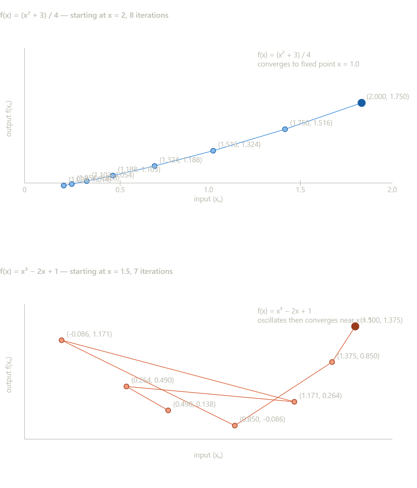
</p>

**Flow theory demo carried out on two sample functions.**
## DEMO for more complex functions
**(image 1)A DEMO FOR $f(x)  = cos(cos( ... (x)))$**
<p align="center">
  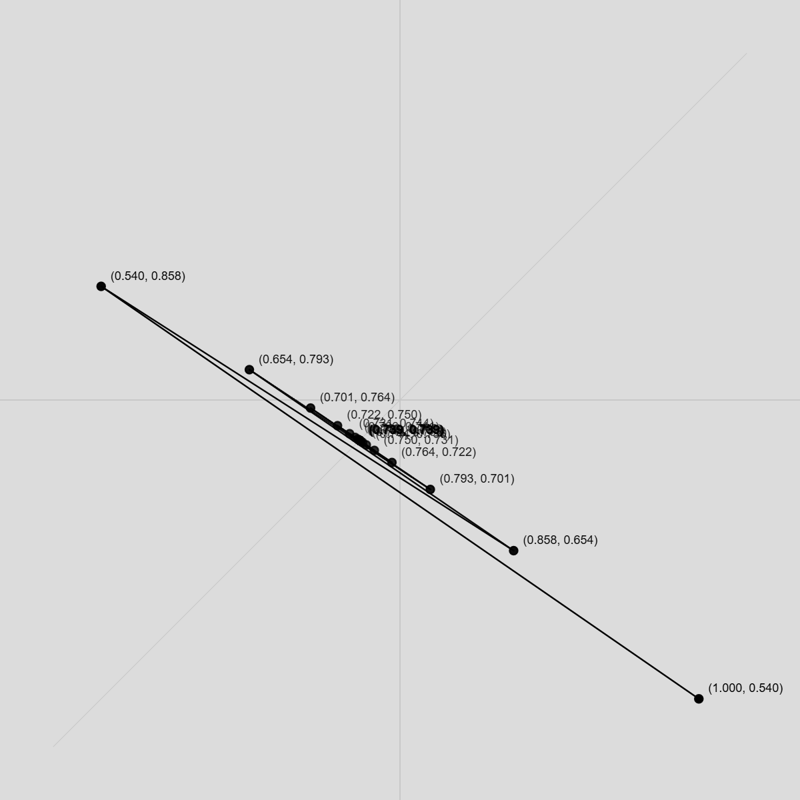
  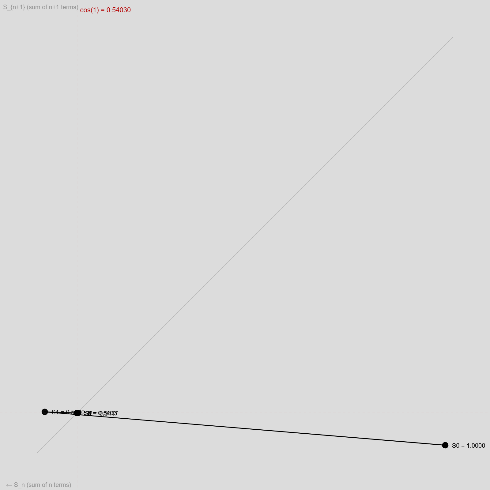
</p>

**(image 2)A demo to visualize f(x) = cos(x) but broken down as multiple points expansion using Taylor series and recursively calculated conditioned from Rule 6: $(sum of n terms, sum of n+1 terms)$**

<p align="center">
  
</p>

## 2.3 Flow thory encodes patterns:

>> A Flow Theory path geometrically encodes the complete computational history of any function — its shape, direction, and termination point reveal convergence, divergence, periodicity or chaos regardless of the function's domain or complexity.

<h1 style="font-size: 2.75em; color: red;"><i>COLLATZ CONJECTURE:</i> </h1>

## 3.1 What is it?
*The Collatz Conjecture* is an unsolved problem in mathematics proposed by Lothar Collatz in 1937.
Given any positive integer n, apply the following rule repeatedly:

$$f(n) = \begin{cases} n/2 & \text{if } n \text{ is even} \\ 3n+1 & \text{if } n \text{ is odd} \end{cases}$$

The conjecture states: **no matter what positive integer you start with, you will always eventually reach 1.**

Example for n = 6:
```
6 → 3 → 10 → 5 → 16 → 8 → 4 → 2 → 1
```
## 3.2 Why is it unsolved?

Despite its elementary statement, no proof exists after 80+ years of attempts.
The sequence behaves unpredictably — small numbers can produce enormously long sequences
before collapsing. Number 27 takes 111 steps and peaks at 9,232 before reaching 1.
The conjecture has been verified computationally for all integers up to 2⁶⁸ but
verification is not proof. Paul Erdős famously remarked:

> *"Mathematics is not yet ready for such problems."*

## 3.3 Existing Visualizations and their Limitations

| Approach | What it shows | Limitation |
|---|---|---|
| Stopping time plot | steps to reach 1 vs starting n | loses sequence structure |
| Collatz graph (directed) | n → f(n) as node-link diagram | cluttered, no geometric insight |
| Georgiou (2018) binary curves | binary sequence → turtle graphics path | encoding is binary not arithmetic |
| 2021 clustering paper | Hamming distance on raw sequences | clusters sequences not geometry |

All existing approaches treat the Collatz sequence as a **list of values**.
None encode each computation step as a geometric mapping.

## 3.4 Why Flow Theory is a Different Approach

Standard analysis asks: *what values does the sequence visit?*  
Flow Theory asks: *what geometric shape does the computation trace?*

By encoding each step as a coordinate pair $(n, f(n))$, Flow Theory converts
the sequence into a **2D geometric object** — a leaf whose shape, slope, and
structure directly reflect the arithmetic character of the number.

This produces features — `mean_slope`, `inter_odd_gaps_mean`, `num_L_shapes` —
that have no equivalent in any existing Collatz dataset, and reveals cluster
structure not visible in raw sequence analysis.

<h1 style="font-size: 2.75em; color: red;"><i>APPLYING FLOW THEORY TO COLLATZ: </i> </h1>

## 4.1 Encoding Rules for Collatz

Given current value $n$, the Flow Theory encoding applies three rules:

| Step | Condition | Point plotted | Shape | Next input |
|---|---|---|---|---|
| Even | $n$ is even | $(n,\ n/2)$ | circle | $n/2$ |
| Odd ×3 | $n$ is odd | $(n,\ 3n)$ | square | $3n$ |
| Odd +1 | after ×3 | $(3n,\ 3n+1)$ | circle | $3n+1$ |

Consecutive points are connected by directed lines.
The path terminates when $n = 1$.

**Key property:** The x-coordinate of each point is always the input,
the y-coordinate is always the output of that single atomic operation.
Output becomes the next input — forming a continuous directed path.

## 4.2 The Collatz Leaf — Individual Number Visualization
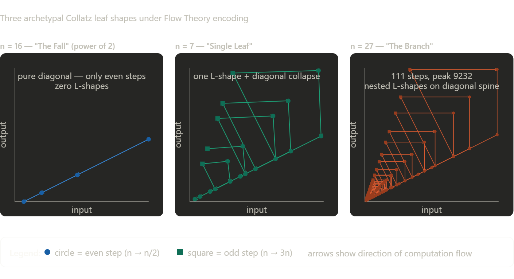

**The Fall** (n = 16): Powers of 2 produce a pure diagonal path — 
only even steps, zero L-shapes, exactly $\log_2(n)$ edges. 
Provably the simplest possible Collatz leaf.

**Single Leaf** (n = 7): One L-shape followed by diagonal collapse. 
The square marks the $3n$ multiplication, the circle marks $+1$, 
then even steps halve the value to 1.

**The Branch** (n = 27): 111 steps, peak value 9232. 
Multiple nested L-shapes on a shared diagonal spine — 
each L-shape is one odd step eruption.

**MORE SAMPLE VISUALIZATIONS:**
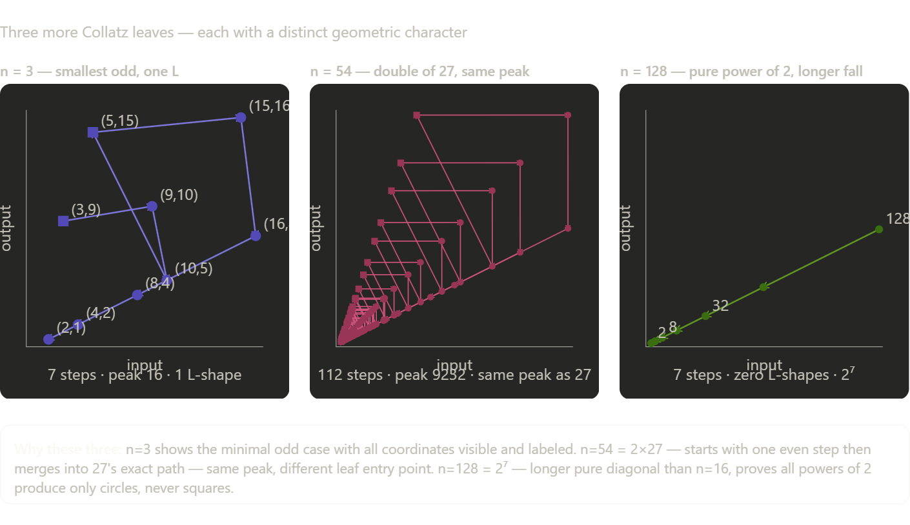

## 4.3 The Hailstone Wing — Overlaid Visualization

When Flow Theory paths for numbers 1 to N are drawn simultaneously 
on a shared canvas, a wing-like structure emerges:

- **Dense cluster top-left** — small numbers with short sequences overlapping
- **Diagonal spine** — the shared even-step attractor all numbers collapse toward
- **Individual leaves** — high-peak numbers like 27, 703 visible as large structures

> **This visualization was done using an older version of `P5js` where y axis is inverted(+ve) towards downward**
<p align="center">
  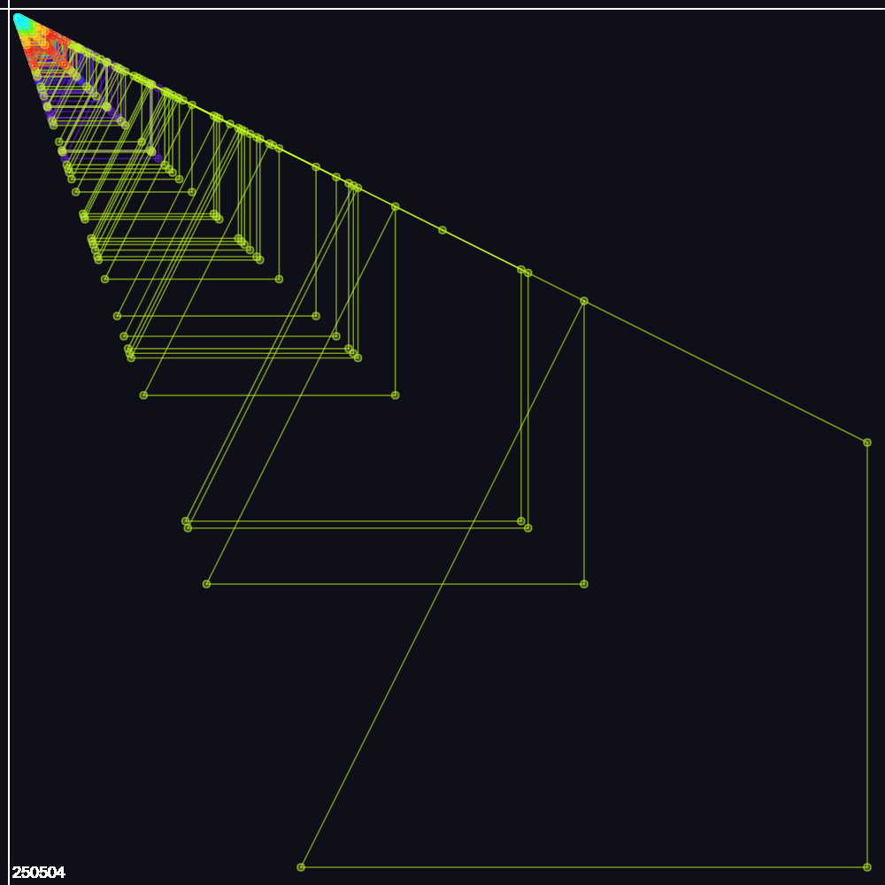
</p>

## 4.4 Named Structures and Observations

| Structure | Description | Example |
|---|---|---|
| The Fall | pure diagonal, zero L-shapes | n = 2, 4, 8, 16 |
| Single Leaf | one L-shape + diagonal | n = 3, 5, 7 |
| The Branch | multiple nested L-shapes | n = 27, 97 |
| Diagonal Spine | shared even-step attractor | visible in all overlays |
| Hailstone Wing | full overlay 1 to N | N = 100, 500, 1200 |

**Key observation:** Every Collatz leaf — regardless of starting number — 
shares the same diagonal spine. The L-shapes represent resistance 
against collapse; the diagonal represents inevitability of reaching 1.
This geometric duality is visible in Flow Theory and invisible in 
raw sequence analysis.

>> *Some more visualizations of overlaid leaves collatz 100 and 450 leaves*
<table>
  <tr>
    <td align="center">
      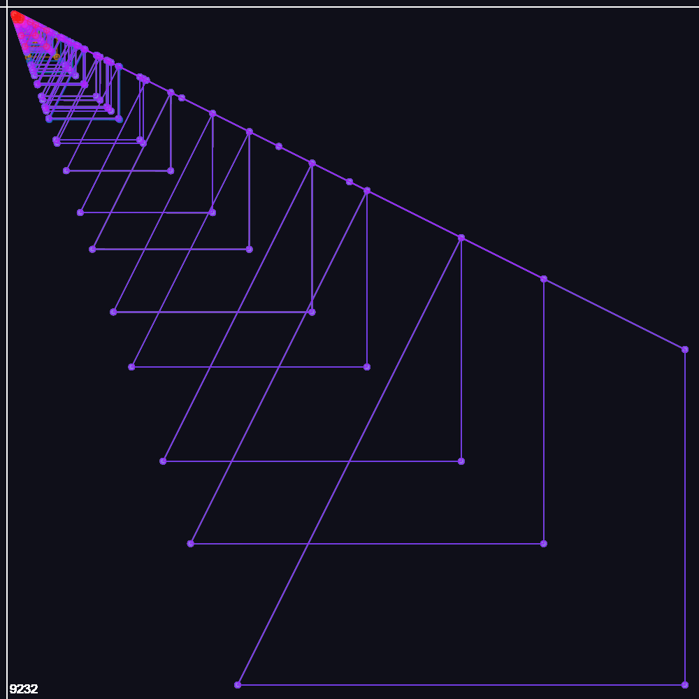
      <br/><em>n = 1 to 100</em>
    </td>
    <td align="center">
      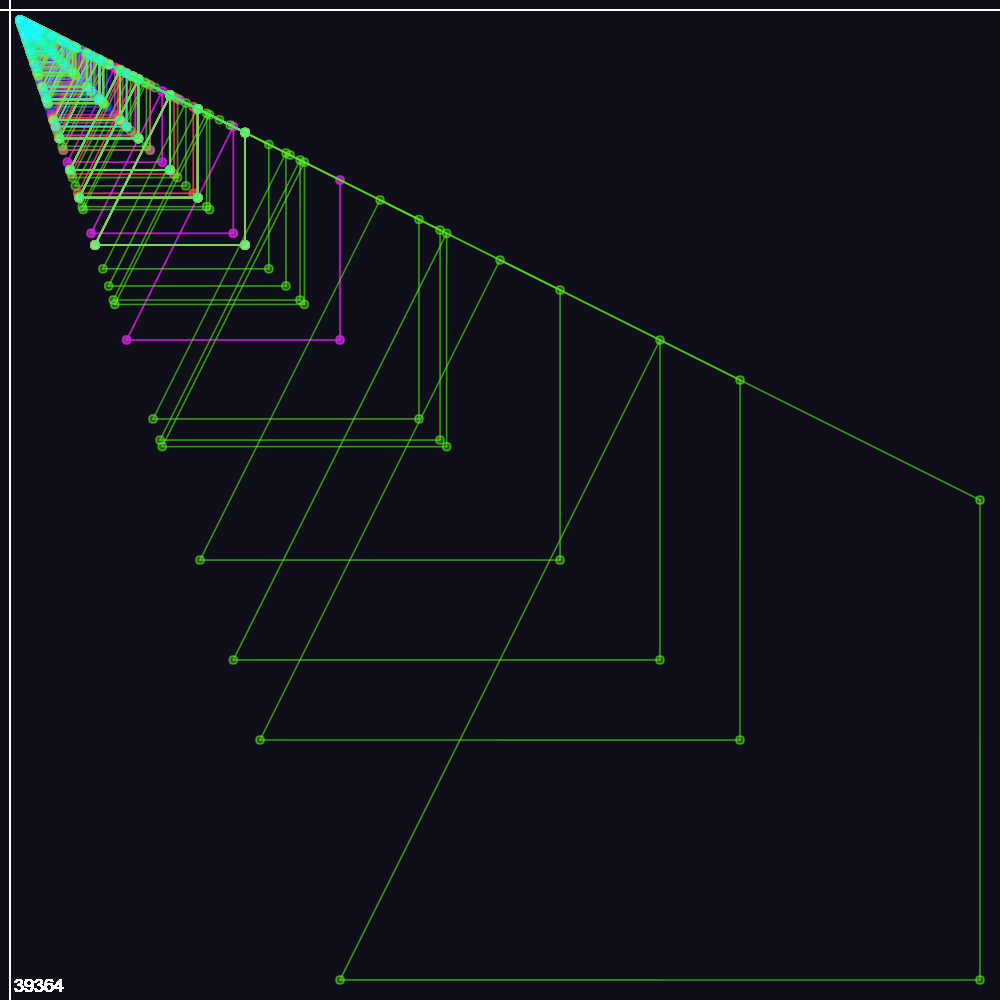
      <br/><em>n = 1 to 450</em>
    </td>
  </tr>
</table>

<h1 style="font-size: 2.75em; color: red;"><i>DATASET: </i> </h1>

## 5.1 Generation method:
The dataset was generated using a python code using `pandas` and `numpy` libraries to basically automate the flow theory algorithm, to calculate various attributes and finally list them and package them into a `.csv` file
>> FOR THE DATASET GENERATION CODE: OPEN THIS LINK ```collatz_gen.py```

## 5.2 FEATURES LISTED
### 5.3 Feature Categories

**Total: 49 features across 6 categories**

---

**Identity (1 feature)**

| Feature | Description |
|---|---|
| `n` | the starting integer |

---

**Basic Sequence Features — standard (7 features)**

These exist in any Collatz analysis and require no special encoding.

| Feature | Description |
|---|---|
| `steps` | total steps to reach 1 |
| `peak` | maximum value reached during sequence |
| `peak_to_n_ratio` | peak / n — how much the sequence spikes relative to start |
| `odd_steps` | count of odd steps taken |
| `even_steps` | count of even steps taken |
| `odd_even_ratio` | odd_steps / even_steps |
| `compression_ratio` | steps / log₂(n) — normalized complexity |

---

**Number Theory Features — standard (11 features)**

Properties of n itself, independent of its Collatz sequence.

| Feature | Description |
|---|---|
| `n_mod_3` | n remainder mod 3 |
| `n_mod_6` | n remainder mod 6 |
| `n_mod_9` | n remainder mod 9 |
| `trailing_zeros` | 2-adic valuation — how many times 2 divides n |
| `binary_length` | number of bits in n |
| `binary_ones` | count of 1s in binary representation |
| `binary_zeros` | count of 0s in binary representation |
| `ones_to_zeros_ratio` | binary_ones / binary_length |
| `is_prime` | 1 if n is prime, 0 otherwise |
| `largest_prime_factor` | largest prime factor of n |
| `merge_point` | first power of 2 hit during sequence |

---

**Flow Theory Rhythm Features — novel (11 features)**

Derived from the timing and spacing of odd steps along the Flow Theory path.
These have no equivalent in standard Collatz analysis.

| Feature | Description | Origin |
|---|---|---|
| `num_L_shapes` | count of L-shaped structures (odd steps) | Flow Theory |
| `max_L_height` | largest vertical jump ratio at any odd step | Flow Theory |
| `mean_L_height` | average vertical jump ratio across all odd steps | Flow Theory |
| `L_height_variance` | variance of vertical jump ratios | Flow Theory |
| `max_consecutive_evens` | longest diagonal run between L-shapes | Flow Theory |
| `mean_consecutive_evens` | average diagonal run length | Flow Theory |
| `first_step_type` | 1 if first step is odd, 0 if even | Flow Theory |
| `first_odd_position` | how many steps before first odd step | Flow Theory |
| `inter_odd_gaps_mean` | mean spacing between consecutive odd steps | Flow Theory |
| `inter_odd_gaps_max` | maximum gap between consecutive odd steps | Flow Theory |
| `inter_odd_gaps_variance` | variance in odd step spacing — rhythm irregularity | Flow Theory |

---

**Flow Theory Geometry Features — novel (17 features)**

Derived from the geometric properties of edges in the Flow Theory coordinate space.
These require the (input, output) coordinate encoding to be computable.

| Feature | Description | Origin |
|---|---|---|
| `num_edges` | total edges in the Flow Theory path | Flow Theory |
| `mean_slope` | average slope across all edges | Flow Theory |
| `slope_variance` | variance of edge slopes | Flow Theory |
| `first_edge_slope` | slope of the very first edge | Flow Theory |
| `last_edge_slope` | slope of the very last edge | Flow Theory |
| `horizontal_edges` | count of near-flat edges (the +1 steps, slope ≈ 1.0) | Flow Theory |
| `vertical_edges` | count of steep edges (the ×3 steps, slope > 2.5) | Flow Theory |
| `diagonal_edges` | count of halving edges (slope ≈ 0.5) | Flow Theory |
| `edge_length_mean` | mean Euclidean distance between consecutive points | Flow Theory |
| `edge_length_variance` | variance in edge lengths | Flow Theory |
| `bounding_box_ratio` | width / height of the leaf's bounding box | Flow Theory |
| `bbox_width` | horizontal span of the leaf | Flow Theory |
| `bbox_height` | vertical span of the leaf | Flow Theory |
| `centroid_x` | mean x-coordinate across all edge points | Flow Theory |
| `centroid_y` | mean y-coordinate across all edge points | Flow Theory |
| `centroid_ratio` | centroid_y / centroid_x — proportional center of leaf | Flow Theory |
| `point_density` | num_edges / bounding box area | Flow Theory |

---

**Raw Edge Lists — metadata (2 features)**

Stored as strings. Not used directly in clustering — retained for 
reference and future sequence-aware analysis.

| Feature | Description |
|---|---|
| `edges` | full ordered list of (input, output) pairs as string |
| `slope_sequence` | ordered list of all edge slopes as string |

---

> **Note:** Flow Theory rhythm and geometry features (28 total) are 
> entirely novel to this encoding. They cannot be computed from a raw 
> Collatz sequence without first applying the Flow Theory coordinate mapping.

<h1 style="font-size: 2.75em; color: red;"><i>ANALYSIS PIPELINE: </i> </h1>

## 6.1 Tools used:
<p align="center">
  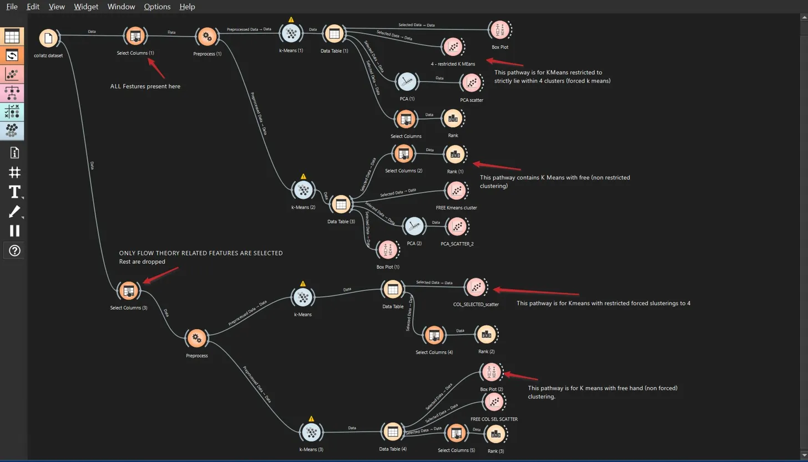
</p>

>> Access the orange work flow file using this link: 

The following workflow was built using the Orange Data mining tool, which enables to quickly scale and build models to analyze the data. It also provides a faster way to obtain interactive visualizations. It also makes data handling easier and safer.

## 6.2 orange workflow overview:
A short description of the Workflow

1) Obtain and load the dataset file
2) Selecting featured required for experimenting
3) Preprocessing we normalize the variables to avoid scaling issues while using distance based clustering algorithms like KMeans
4) perform K Means and analyze the subsequent clusters through Scatter plots, box plots.

**Some certain ML-related concepts discussed:**
> **Normalization** scales features to a common range (usually [0,1]) to ensure all features contribute equally to the model and improve convergence during training.
> $$x_{\text{std}} = \frac{x - \mu}{\sigma}$$
> Centers data around mean=0 with standard deviation=1, where $\mu = \frac{1}{n}\sum_{i=1}^{n} x_i$ and $\sigma = \sqrt{\frac{1}{n}\sum_{i=1}^{n}(x_i - \mu)^2}$. <br/>
> **Why normalize?** Prevents features with larger ranges from dominating gradient descent, speeds up convergence, and improves model performance.

> **K-Means Clustering** — an unsupervised algorithm that partitions data 
> into k groups by minimizing the distance between each point and its 
> nearest cluster center. Iterates until centers stabilize. 
> No labels required — structure emerges from the data itself.

> **PCA (Principal Component Analysis)** — reduces high-dimensional feature 
> space to 2D for visualization while preserving maximum variance. 
> Used to generate scatter plots showing cluster separation visually.


## 6.3 Clustering Experiments

Four KMeans experiments were conducted to isolate the contribution 
of Flow Theory features specifically:

| Experiment | Features Used | K | Label |
|---|---|---|---|
| E1 | All 47 features | 4 (forced) | Restricted — All |
| E2 | All 47 features | free | Unrestricted — All |
| E3 | Flow Theory only (28 features) | 4 (forced) | Restricted — FT |
| E4 | Flow Theory only (28 features) | free | Unrestricted — FT |

> **Restricted (forced k=4)** — KMeans told exactly how many clusters 
> to find. Useful for direct comparison between experiments.

> **Unrestricted (free k)** — KMeans chooses the natural number of 
> clusters from the data. Reveals what structure genuinely exists 
> without assumption.

---

**Why this 2×2 design:**

- E1 vs E3 — does removing standard features change cluster structure?
- E2 vs E4 — do natural clusters change when only geometric features used?
- E1 vs E2 — does forcing k=4 distort the natural structure?
- E3 vs E4 — same question but for Flow Theory features alone

**Key finding from E3 vs E1:**
Flow Theory features alone reproduced the same cluster structure 
as the full 47-feature dataset — confirming geometric encoding 
is sufficient without standard sequence statistics.

## 6.4 Ablation findings:
> **Silhouette Score** measures how well each data point fits its own 
> cluster compared to neighbouring clusters. Ranges from -1 to 1 — 
> higher means tighter, better separated clusters. A score above 0.2 
> is generally considered meaningful structure.

| k | All Features (47) | Flow Theory Only (28 + 5) | Difference |
|---|---|---|---|
| 2 | 0.237 | 0.274 | +0.037 |
| **3** | **0.239** | **0.278** | **+0.039** |
| 4 | 0.199 | 0.242 | +0.043 |
| 5 | 0.203 | 0.243 | +0.040 |
| 6 | 0.201 | 0.249 | +0.048 |

> **Flow Theory features improve silhouette score by ~16% at optimal k=3 
> (0.239 → 0.278) — removing standard sequence features produces tighter, 
> more meaningful cluster separation.**

- Both feature sets independently agree on **k=3** as the optimal number 
  of clusters — the three natural families are a robust finding regardless 
  of which features are used
- Flow Theory only clustering produces consistently higher silhouette scores 
  across all values of k, not just at the optimum
- Geometric encoding captures cluster-discriminative structure more 
  effectively than the full feature set, this may be due to standard features introduce 
  noise that slightly blurs cluster boundaries
- This quantitatively confirms the ablation finding — 28 geometric 
  features outperform 47 mixed features, suggesting Flow Theory encoding 
  is not just sufficient but superior for this classification task
- Note: the Flow Theory experiment retained 33 features — 28 geometric 
  features plus 5 non-Flow-Theory features (`n`, `peak`, `peak_to_n_ratio`, 
  `is_prime`, and one additional). These 5 ranked near the bottom of 
  feature importance (scores < 0.15) and contribute negligibly to 
  cluster separation(with exception of `compression_ratio`) their inclusion does not materially affect the 
  result. A strict 28-feature experiment would likely produce equal 
  or marginally better scores.

<h1 style="font-size: 2.75em; color: red;"><i>CLUSTERING RESULTS: </i> </h1>

## 7.1 Clustering results:
We analyze different graphs of different normalized variables and analyze the state of different cluster combinations, these cluster plots are from free KMeans with Flow theory variables.

<div style="width:90%;margin:0 auto;padding:1rem 0">

<p style="font-size:11px;font-weight:500;letter-spacing:0.08em;color:var(--color-text-tertiary);margin:0 0 12px">SELECTED SCATTER PLOTS BETWEEN NORMALIZED VARIABLES</p>

<table style="width:100%;border-collapse:separate;border-spacing:8px">
  <tr>
    <td style="width:50%;vertical-align:top;background:var(--color-background-secondary);border-radius:8px;padding:8px;border:0.5px solid var(--color-border-tertiary)">
      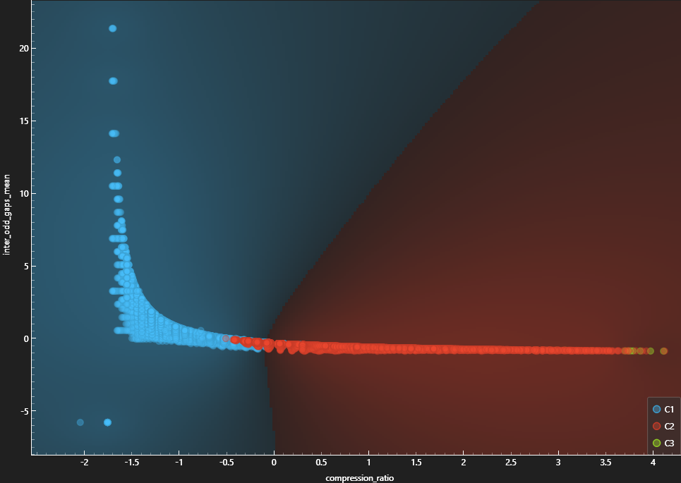
      <p style="font-size:11px;font-weight:500;color:var(--color-text-primary);margin:6px 0 2px">compression_ratio vs inter_odd_gaps_mean</p>
      <p style="font-size:11px;color:var(--color-text-secondary);margin:0;line-height:1.5">C2 forms a distinctive horn shape with clean diagonal boundary. C3 extreme outliers sit at maximum compression and minimum gap mean.</p>
    </td>
    <td style="width:50%;vertical-align:top;background:var(--color-background-secondary);border-radius:8px;padding:8px;border:0.5px solid var(--color-border-tertiary)">
      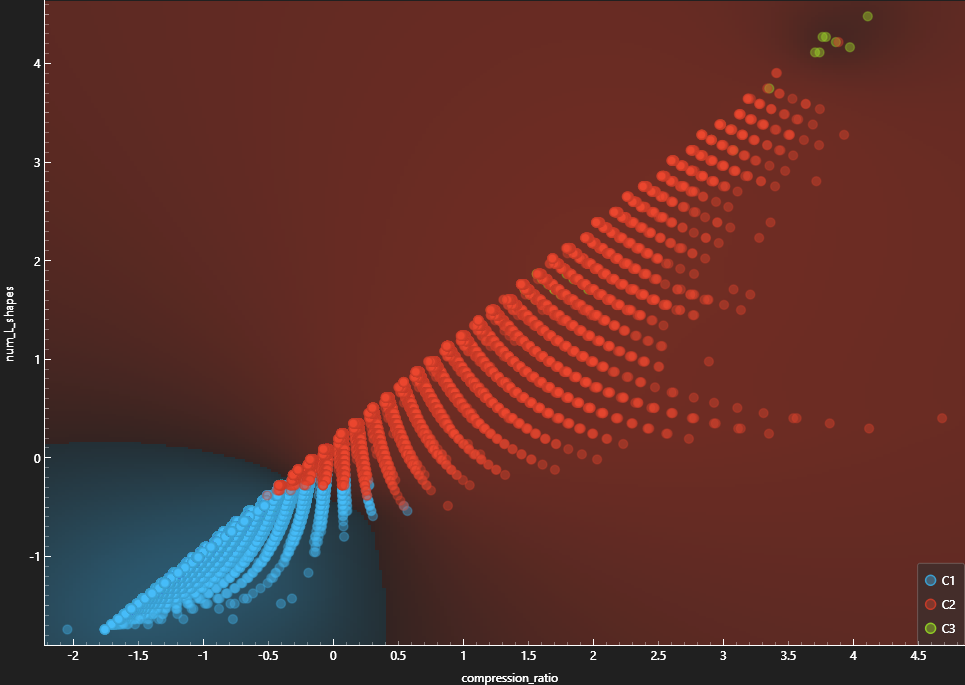
      <p style="font-size:11px;font-weight:500;color:var(--color-text-primary);margin:6px 0 2px">compression_ratio vs num_L_shapes</p>
      <p style="font-size:11px;color:var(--color-text-secondary);margin:0;line-height:1.5">C2 produces a striking comb/fan structure — parallel diagonal lines representing discrete odd step count families. C3 clearly visible at top-right extreme.</p>
    </td>
  </tr>
  <tr>
    <td style="width:50%;vertical-align:top;background:var(--color-background-secondary);border-radius:8px;padding:8px;border:0.5px solid var(--color-border-tertiary)">
      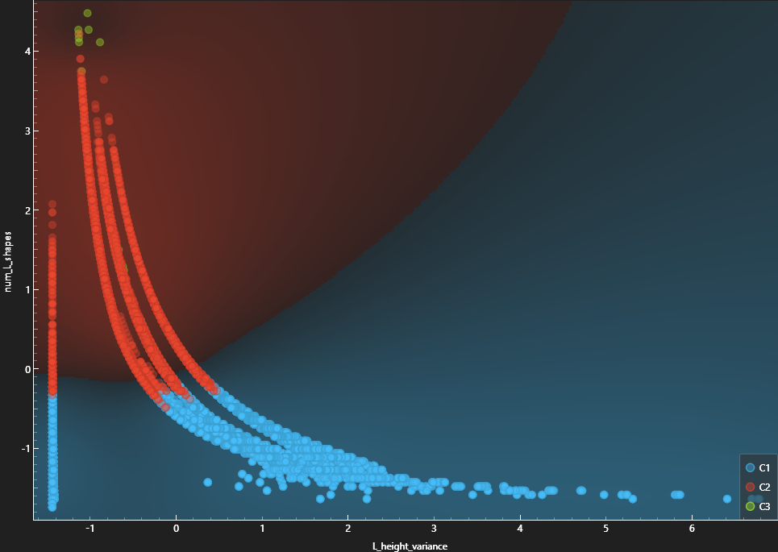
      <p style="font-size:11px;font-weight:500;color:var(--color-text-primary);margin:6px 0 2px">L_height_variance vs num_L_shapes</p>
      <p style="font-size:11px;color:var(--color-text-secondary);margin:0;line-height:1.5">Three distinct red fan tracks within C2 suggest internal sub-families. C1 forms a decaying spike — high variance with few L-shapes tapering as complexity grows.</p>
    </td>
    <td style="width:50%;vertical-align:top;background:var(--color-background-secondary);border-radius:8px;padding:8px;border:0.5px solid var(--color-border-tertiary)">
      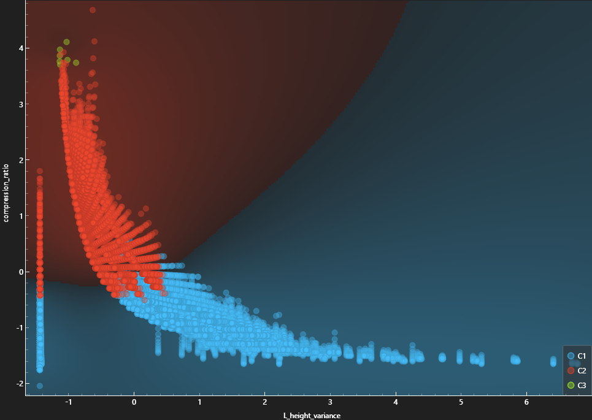
      <p style="font-size:11px;font-weight:500;color:var(--color-text-primary);margin:6px 0 2px">compression_ratio vs L_height_variance</p>
      <p style="font-size:11px;color:var(--color-text-secondary);margin:0;line-height:1.5">C2 horn/spiral shape with one of the cleanest diagonal cluster boundaries in the dataset. C3 extreme outliers at maximum compression, minimum L_height_variance.</p>
    </td>
  </tr>
  <tr>
    <td style="width:50%;vertical-align:top;background:var(--color-background-secondary);border-radius:8px;padding:8px;border:0.5px solid var(--color-border-tertiary)">
      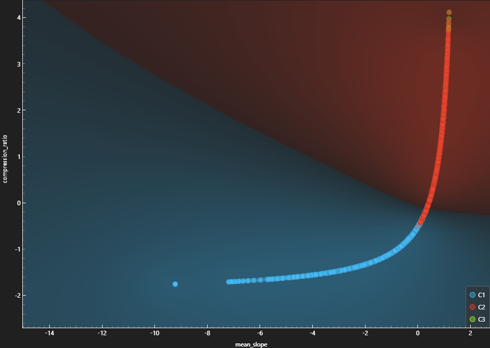
      <p style="font-size:11px;font-weight:500;color:var(--color-text-primary);margin:6px 0 2px">mean_slope vs compression_ratio</p>
      <p style="font-size:11px;color:var(--color-text-secondary);margin:0;line-height:1.5">Hyperbolic decision boundary separating C1 hockey stick from C2 vertical rocket. Powers of 2 isolated bottom-left. C3 at absolute maximum of both axes.</p>
    </td>
    <td style="width:50%;vertical-align:top;background:var(--color-background-secondary);border-radius:8px;padding:8px;border:0.5px solid var(--color-border-tertiary)">
      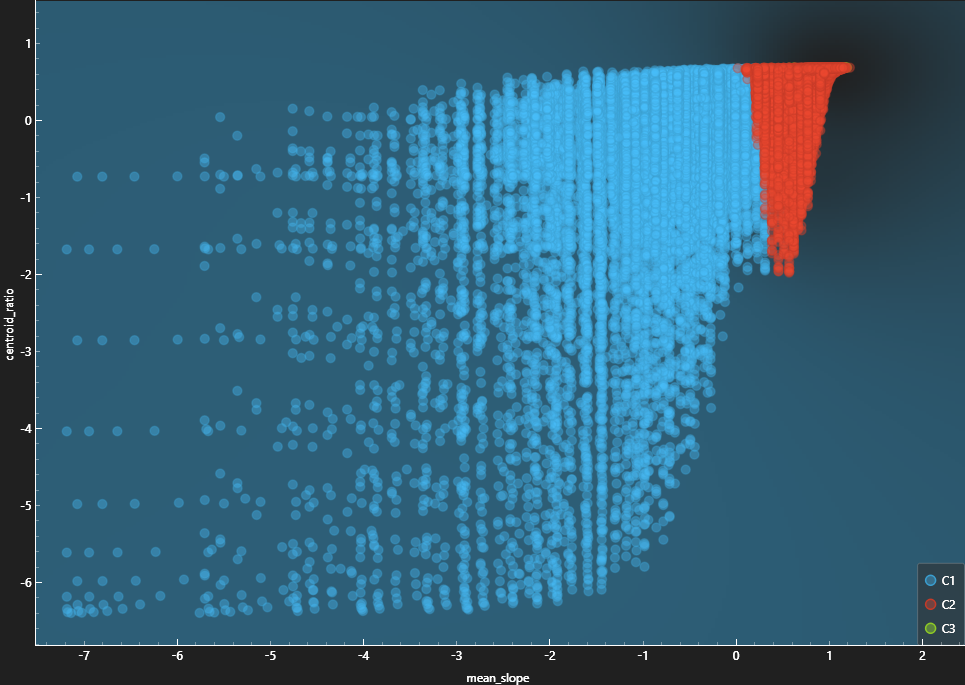
      <p style="font-size:11px;font-weight:500;color:var(--color-text-primary);margin:6px 0 2px">mean_slope vs centroid_ratio</p>
      <p style="font-size:11px;color:var(--color-text-secondary);margin:0;line-height:1.5">C2 forms a stalactite shape — wide spread tapering to a narrow point. C1 scatters freely confirming centroid_ratio has low discriminative power for simple sequences.</p>
    </td>
  </tr>
  <tr>
    <td style="width:50%;vertical-align:top;background:var(--color-background-secondary);border-radius:8px;padding:8px;border:0.5px solid var(--color-border-tertiary)">
      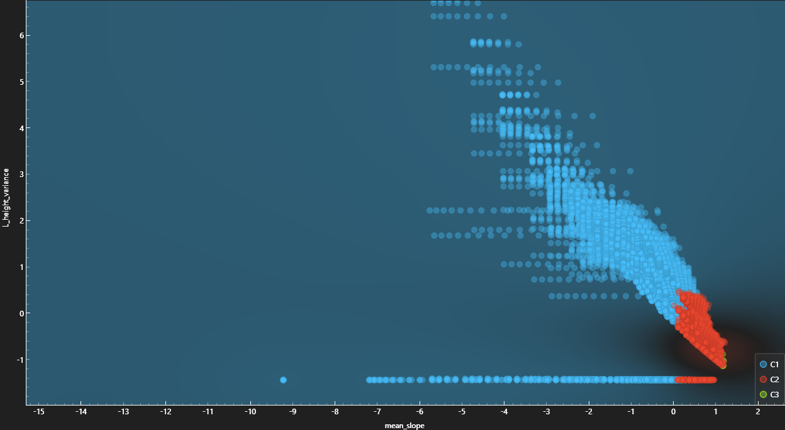
      <p style="font-size:11px;font-weight:500;color:var(--color-text-primary);margin:6px 0 2px">mean_slope vs L_height_variance</p>
      <p style="font-size:11px;color:var(--color-text-secondary);margin:0;line-height:1.5">Flat floor at L_height_variance ≈ -1.5 confirms trivial 1/n convergence. Blue staircase pattern shows discrete structure in small numbers with few odd steps.</p>
    </td>
    <td style="width:50%;vertical-align:top;background:var(--color-background-secondary);border-radius:8px;padding:8px;border:0.5px solid var(--color-border-tertiary)">
      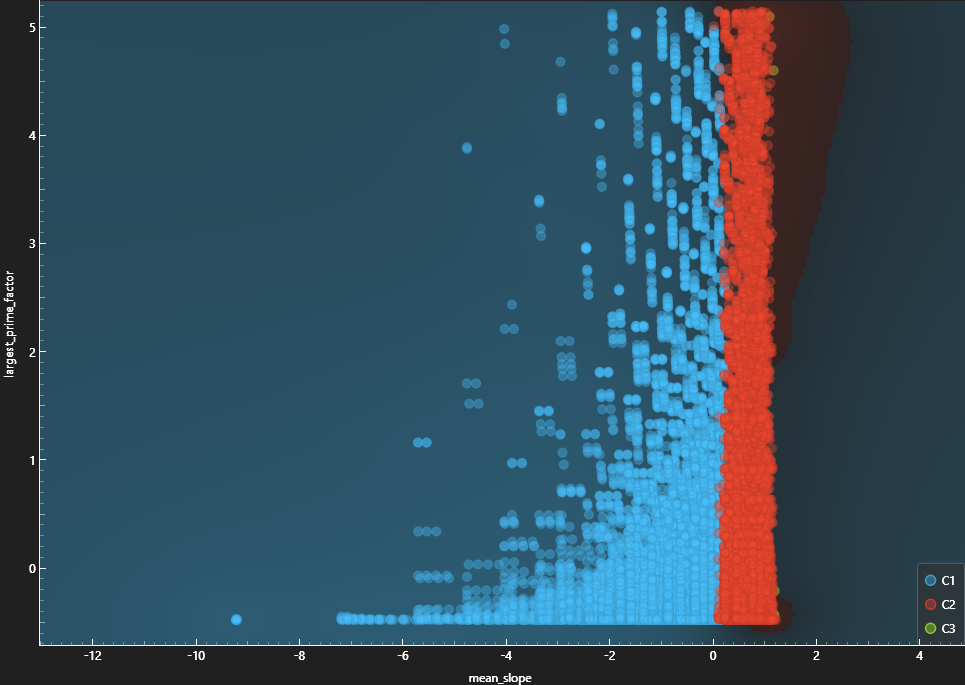
      <p style="font-size:11px;font-weight:500;color:var(--color-text-primary);margin:6px 0 2px">mean_slope vs largest_prime_factor</p>
      <p style="font-size:11px;color:var(--color-text-secondary);margin:0;line-height:1.5">Hard boundary at mean_slope ≈ -1 separating C1 from C2. largest_prime_factor shows no discriminative power — both clusters span full y-axis — confirming it ranked near bottom in feature importance.</p>
    </td>
  </tr>
  <tr>
    <td style="width:50%;vertical-align:top;background:var(--color-background-secondary);border-radius:8px;padding:8px;border:0.5px solid var(--color-border-tertiary)">
      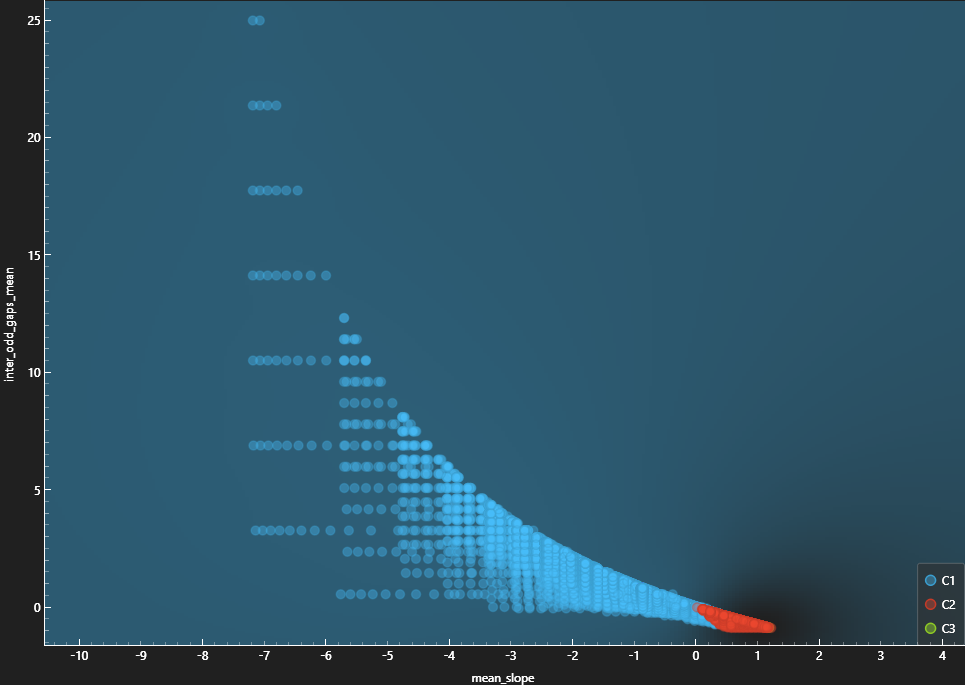
      <p style="font-size:11px;font-weight:500;color:var(--color-text-primary);margin:6px 0 2px">mean_slope vs inter_odd_gaps_mean</p>
      <p style="font-size:11px;color:var(--color-text-secondary);margin:0;line-height:1.5">The diffraction stripe pattern — discrete parallel stripes emerging from rational odd/even step ratios. Adjacent stripes differ by exactly one step. Multiple diffraction orders of decreasing prevalence.</p>
    </td>
    <td style="width:50%;vertical-align:top;background:var(--color-background-secondary);border-radius:8px;padding:8px;border:0.5px solid var(--color-border-tertiary)">
      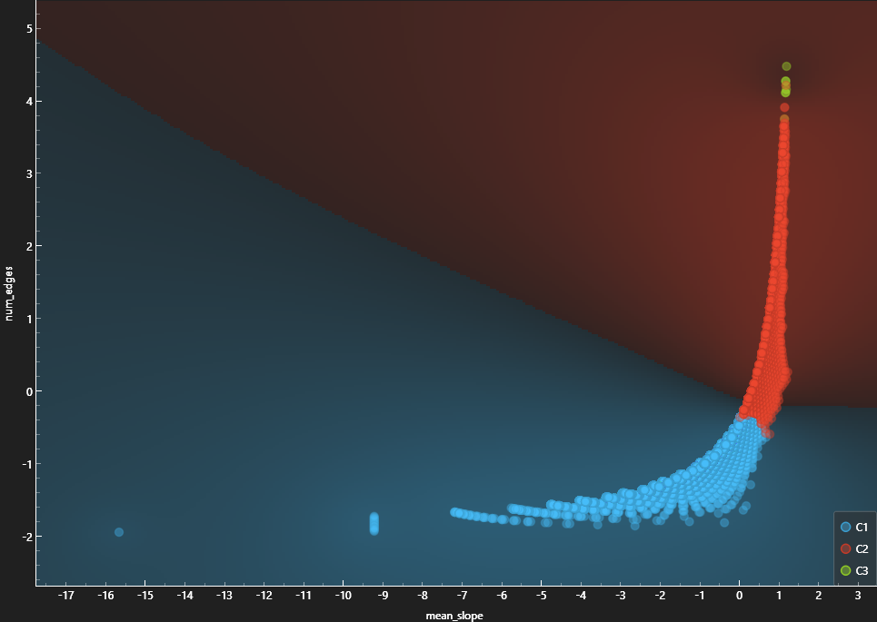
      <p style="font-size:11px;font-weight:500;color:var(--color-text-primary);margin:6px 0 2px">Flow Theory only — num_edges vs mean_slope</p>
      <p style="font-size:11px;color:var(--color-text-secondary);margin:0;line-height:1.5">The flagship visualization — hockey stick shape with C3 extreme outliers cleanly floating above the blue body. Produced using Flow Theory features exclusively — cleaner C3 separation than full feature set.</p>
    </td>
  </tr>
</table>

</div>

### 7.2 Three Natural Families — Core Analysis

Free KMeans on 50,000 numbers consistently converges to **k=3** 
as optimal (silhouette = 0.278 on Flow Theory features).

---

**C1 — Even Runners (blue)**

The largest cluster. Numbers whose sequences are dominated by 
even steps — long diagonal runs with rare odd steps spaced far apart.

| Feature | Normalized Value | Meaning |
|---|---|---|
| mean_slope | `-0.713206` | heavily even-dominated |
| inter_odd_gaps_mean | `0.581452` | odd steps far apart |
| num_L_shapes | `-0.842` | very few L-shapes |
| compression_ratio | `-0.839314` | short relative to size |
| edge_length_mean | `-0.11` | small geometric scale |

Geometrically: long diagonal spine with sparse L-shapes. 
Includes powers of 2 as the extreme case — zero L-shapes, 
pure diagonal, provably isolated.

---

**C2 — Complex Sequences (red)**

The second largest cluster. Numbers with frequent odd steps, 
shorter even runs, longer sequences.

| Feature | Normalized Value | Meaning |
|---|---|---|
| mean_slope | `0.708993` | odd-leaning |
| inter_odd_gaps_mean | `-0.578` | odd steps closer together |
| num_L_shapes | `0.835` | many L-shapes |
| compression_ratio | `0.832494` | long relative to size |
| edge_length_mean | `0.0671` | moderate geometric scale |

Geometrically: dense L-shapes with shorter diagonal runs 
between them. The leaf has multiple eruptions before 
collapsing toward 1.

---

**C3 — Extreme Outliers (green)**

Tiny cluster — fewer than 1% of numbers. Geometrically and 
mathematically the most distinct family.

| Feature | Normalized Value | Meaning |
|---|---|---|
| mean_slope | `0.972116` | most odd-heavy |
| inter_odd_gaps_mean | `-0.736392` | densest odd step packing |
| num_L_shapes | `2.320` | most L-shapes by far |
| compression_ratio | `2.09456` | extremely long sequences |
| edge_length_mean | `23.4569` | geometrically enormous |
| centroid_ratio variance | `0.00045` | near-zero — geometric invariant |

Geometrically: densely packed L-shapes, enormous edge lengths 
because sequence values reach millions. Paradoxically the most 
geometrically consistent family — centroid_ratio is nearly 
identical across all C3 members regardless of starting value.
## 7.3 BOX PLOTS:

<div style="width:90%;margin:0 auto;padding:1rem 0">

<p style="font-size:11px;font-weight:500;letter-spacing:0.08em;color:var(--color-text-tertiary);margin:0 0 12px">BOX PLOT ANALYSIS — FEATURE DISTRIBUTIONS PER CLUSTER</p>

<table style="width:100%;border-collapse:separate;border-spacing:8px">
  <tr>
    <td style="width:50%;vertical-align:top;background:var(--color-background-secondary);border-radius:8px;padding:8px;border:0.5px solid var(--color-border-tertiary)">
      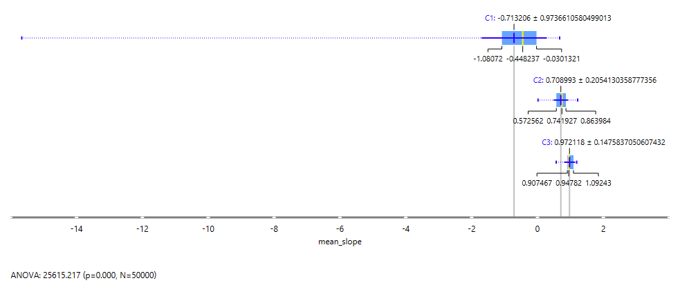
      <p style="font-size:11px;font-weight:500;color:var(--color-text-primary);margin:6px 0 2px">mean_slope</p>
      <p style="font-size:11px;color:var(--color-text-secondary);margin:0;line-height:1.5">Perfect linear ordering across all clusters — the single most discriminative Flow Theory feature. C1 heavily negative, C3 most positive.</p>
    </td>
    <td style="width:50%;vertical-align:top;background:var(--color-background-secondary);border-radius:8px;padding:8px;border:0.5px solid var(--color-border-tertiary)">
      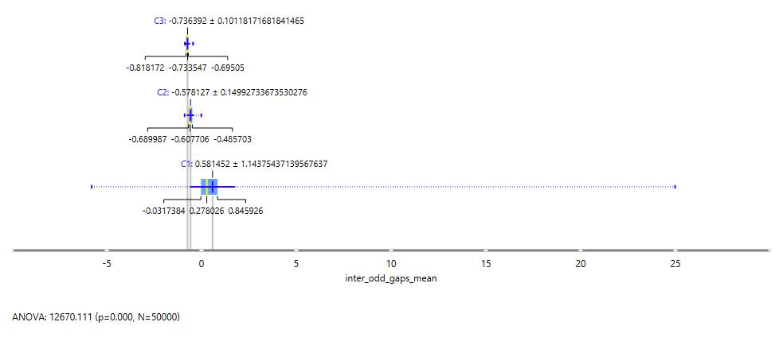
      <p style="font-size:11px;font-weight:500;color:var(--color-text-primary);margin:6px 0 2px">inter_odd_gaps_mean</p>
      <p style="font-size:11px;color:var(--color-text-secondary);margin:0;line-height:1.5">Reversed ordering — C1 has largest gaps between odd steps (long even runs), C3 has smallest gaps (densely packed L-shapes).</p>
    </td>
  </tr>
  <tr>
    <td style="width:50%;vertical-align:top;background:var(--color-background-secondary);border-radius:8px;padding:8px;border:0.5px solid var(--color-border-tertiary)">
      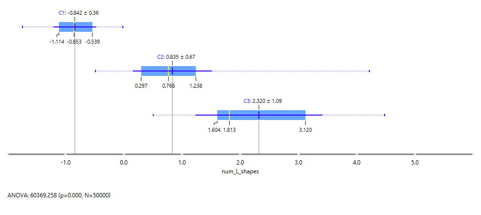
      <p style="font-size:11px;font-weight:500;color:var(--color-text-primary);margin:6px 0 2px">num_L_shapes</p>
      <p style="font-size:11px;color:var(--color-text-secondary);margin:0;line-height:1.5">Perfect ordering C1 &lt; C2 &lt; C3 — directly counts L-shaped structures in the leaf. Mirrors horizontal and vertical edge counts exactly.</p>
    </td>
    <td style="width:50%;vertical-align:top;background:var(--color-background-secondary);border-radius:8px;padding:8px;border:0.5px solid var(--color-border-tertiary)">
      
      <p style="font-size:11px;font-weight:500;color:var(--color-text-primary);margin:6px 0 2px">num_edges</p>
      <p style="font-size:11px;color:var(--color-text-secondary);margin:0;line-height:1.5">Total edges in the Flow Theory path — clean separation between all three clusters. Directly encodes sequence length in geometric terms.</p>
    </td>
  </tr>
  <tr>
    <td style="width:50%;vertical-align:top;background:var(--color-background-secondary);border-radius:8px;padding:8px;border:0.5px solid var(--color-border-tertiary)">
      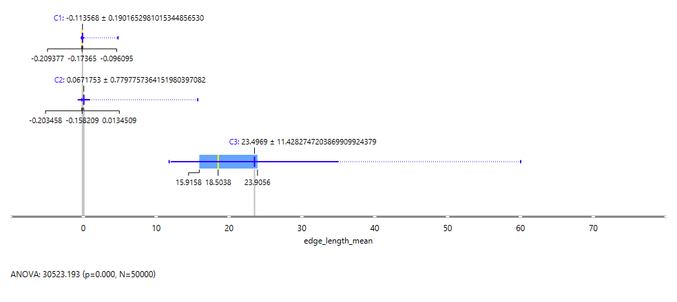
      <p style="font-size:11px;font-weight:500;color:var(--color-text-primary);margin:6px 0 2px">edge_length_mean</p>
      <p style="font-size:11px;color:var(--color-text-secondary);margin:0;line-height:1.5">C3 completely isolated — mean edge length ~23.5 normalized vs near-zero for C1 and C2. Extreme numbers produce geometrically enormous edges as values reach millions.</p>
    </td>
    <td style="width:50%;vertical-align:top;background:var(--color-background-secondary);border-radius:8px;padding:8px;border:0.5px solid var(--color-border-tertiary)">
      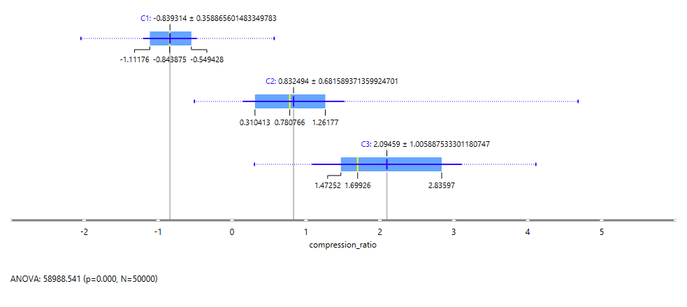
      <p style="font-size:11px;font-weight:500;color:var(--color-text-primary);margin:6px 0 2px">compression_ratio</p>
      <p style="font-size:11px;color:var(--color-text-secondary);margin:0;line-height:1.5">Steps normalized by log₂(n) — clean cluster separation. C3 far above average confirming extreme sequences are disproportionately long relative to their starting value.</p>
    </td>
  </tr>
  <tr>
    <td style="width:50%;vertical-align:top;background:var(--color-background-secondary);border-radius:8px;padding:8px;border:0.5px solid var(--color-border-tertiary)">
      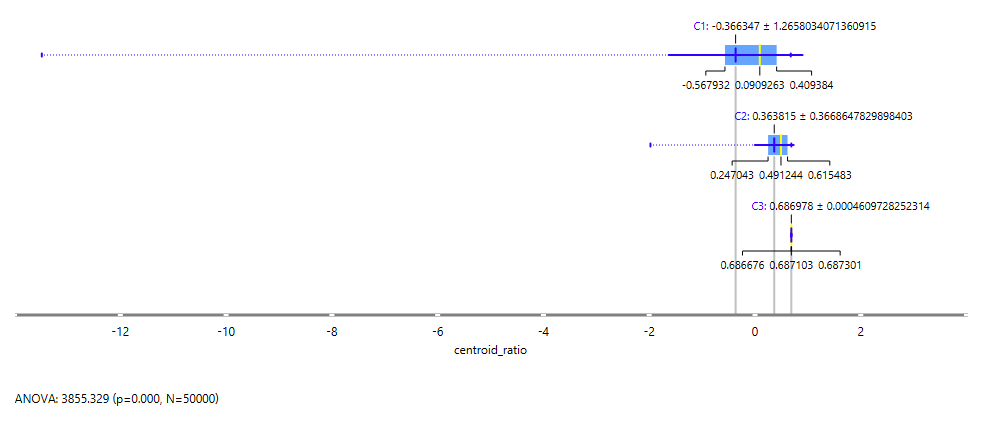
      <p style="font-size:11px;font-weight:500;color:var(--color-text-primary);margin:6px 0 2px">centroid_ratio</p>
      <p style="font-size:11px;color:var(--color-text-secondary);margin:0;line-height:1.5">C3 has near-zero variance — a geometric invariant. All extreme numbers share nearly identical centroid ratios regardless of starting value, suggesting a fixed proportional leaf shape.</p>
    </td>
    <td style="width:50%;vertical-align:top;background:var(--color-background-secondary);border-radius:8px;padding:8px;border:0.5px solid var(--color-border-tertiary)">
      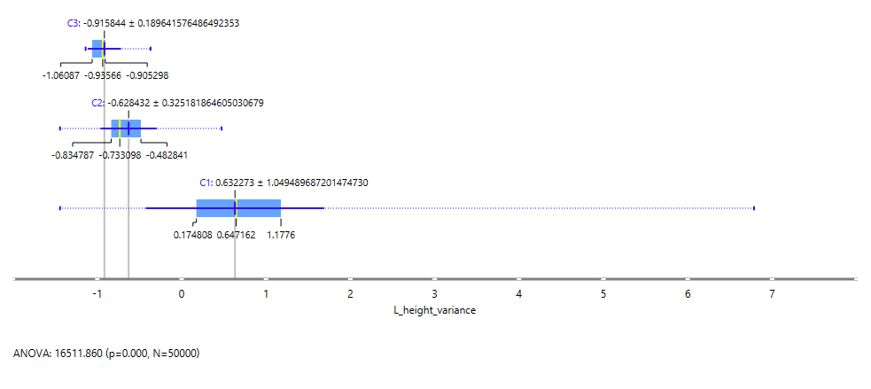
      <p style="font-size:11px;font-weight:500;color:var(--color-text-primary);margin:6px 0 2px">L_height_variance</p>
      <p style="font-size:11px;color:var(--color-text-secondary);margin:0;line-height:1.5">Dismissed finding — variance decreases trivially as n grows (1/n convergence). Included for completeness and transparency.</p>
    </td>
  </tr>
  <tr>
    <td style="width:50%;vertical-align:top;background:var(--color-background-secondary);border-radius:8px;padding:8px;border:0.5px solid var(--color-border-tertiary)">
      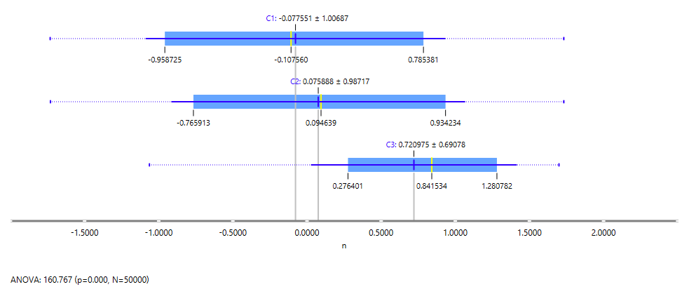
      <p style="font-size:11px;font-weight:500;color:var(--color-text-primary);margin:6px 0 2px">n (starting value)</p>
      <p style="font-size:11px;color:var(--color-text-secondary);margin:0;line-height:1.5">Included as reference — shows cluster membership is not simply determined by the magnitude of n. All three clusters span overlapping ranges of starting values.</p>
    </td>
    <td style="width:50%;vertical-align:top;background:var(--color-background-secondary);border-radius:8px;padding:8px;border:0.5px solid var(--color-border-tertiary)">
      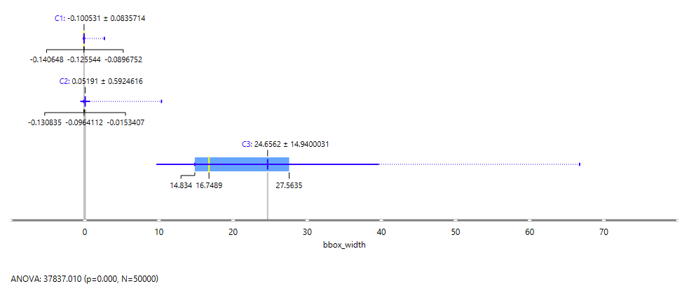
      <p style="font-size:11px;font-weight:500;color:var(--color-text-primary);margin:6px 0 2px">bbox_width</p>
      <p style="font-size:11px;color:var(--color-text-secondary);margin:0;line-height:1.5">Horizontal span of the leaf bounding box. Low discriminative power — ranked near bottom in feature importance. Included to show scale-dependent features add limited clustering value.</p>
    </td>
  </tr>
</table>

</div>


_________________________________________________________________________________________________________________
<style>
.rf-root{font-family:var(--font-sans);color:var(--color-text-primary);border-top:3px solid #378ADD;padding:2rem 1.5rem 1.5rem;background:#EAF3DE;border-radius:8px;margin-top:2rem}
.rf-name{font-size:28px;font-weight:500;margin:0 0 4px;color:#5F5E5A}
.rf-sub{font-size:13px;color:#5F5E5A;margin:0 0 1.5rem}
.rf-grid{display:grid;grid-template-columns:1fr 1fr;gap:1.5rem;margin-bottom:1.5rem}
.rf-section-title{font-size:11px;font-weight:500;text-transform:uppercase;letter-spacing:0.08em;color:#5F5E5A;margin:0 0 8px}
.rf-note{font-size:13px;color:#444441;line-height:1.6;margin:0 0 6px;padding-left:12px;border-left:2px solid #97C459}
.rf-badge{display:inline-flex;align-items:center;gap:5px;font-size:11px;padding:4px 10px;border-radius:20px;border:0.5px solid #97C459;color:#3B6D11;margin:3px;background:#ffffff}
.rf-badge-main{border-color:#3B6D11;color:#27500A;font-weight:500;background:#C0DD97}
.rf-status{display:inline-flex;align-items:center;gap:6px;font-size:12px;padding:4px 12px;border-radius:20px;background:#ffffff;color:#3B6D11;border:0.5px solid #97C459}
.rf-dot{width:6px;height:6px;border-radius:50%;background:#639922;display:inline-block}
.rf-ack{font-size:12px;color:#5F5E5A;line-height:1.7;margin:0}
.rf-divider{border:none;border-top:0.5px solid #97C459;margin:1.2rem 0}
.rf-license{font-size:11px;color:#5F5E5A}
.rf-highlight{background:#378ADD;color:#ffffff;padding:2px 8px;border-radius:4px;font-size:12px;font-weight:500}
.rf-contributor{font-size:12px;color:#3B6D11;margin:0 0 3px;padding-left:8px}
</style>


<div class="rf-root">

  <p class="rf-name">Abhay Ramasamy</p>
  <p class="rf-sub">B.Tech Student &nbsp;·&nbsp; IITM BSDS&nbsp;·&nbsp; IIITDM &nbsp; Interested in SLAM, Perception & AI Research</p>

  <div style="margin-bottom:1.2rem">
    <span class="rf-highlight">Flow Theory</span>&nbsp;
    <span style="font-size:13px;color:#444441">— A novel geometric encoding of Collatz sequences that reveals discrete cluster structure, phase space patterns and geometric families not found in existing literature. Originally conceived during COVID-19 lockdown, 8th standard.</span>
  </div>

<div class="rf-grid">
<div>
      <p class="rf-section-title">Key Takeaways</p>
      <p class="rf-note">Flow Theory encodes each computation step as a 2D coordinate pair — the path shape geometrically fingerprints the function's behaviour</p>
      <p class="rf-note">Unsupervised clustering on geometric features naturally separates 50,000 Collatz numbers into 3–4 distinct families without labels</p>
      <p class="rf-note">Powers of 2 are provably and perfectly isolated — zero L-shapes, only diagonal edges, derivable from encoding rules alone</p>
      <p class="rf-note">Flow Theory features alone reproduce full cluster structure — geometric encoding is sufficient without standard sequence statistics</p>
</div>
<div>
      <p class="rf-section-title">Project Status</p>
      <div style="margin-bottom:12px">
        <span class="rf-status"><span class="rf-dot"></span>Active — review</span>
      </div>
      <p style="font-size:12px;color:#5F5E5A;margin:0 0 4px">Empirically verified on n = 1 to 50,000.</p>
      <p style="font-size:12px;color:#5F5E5A;margin:0 0 12px">Formal mathematical proofs pending. Findings not yet peer reviewed.</p>

<p class="rf-section-title" style="margin-top:12px">Contributors & Advisors</p>
      <p class="rf-contributor">Abhay Ramasamy</p>
      

<hr class="rf-divider"/>

<p class="rf-section-title">License</p>
<p class="rf-license">MIT License — free to use, modify and distribute with attribution.<br/>Original Flow Theory concept © Abhay Ramasamy, 2020 (COVID lockdown origin).</p>
</div></div>

  <hr class="rf-divider"/>

  <p class="rf-section-title">Tools & Libraries</p>
  <div style="margin-bottom:1rem">
    <span class="rf-badge" style="background: #e632fa;border-color:#C85A1E;color:#ffffff;font-weight:500">P5. js</span>
    <span class="rf-badge" style="background: #fb9f71; border-color:#C85A1E;color:#ffffff;font-weight:500">Orange Datamining3</span>
    <span class="rf-badge">🐍 Python</span>
    <span class="rf-badge">pandas</span>
    <span class="rf-badge">numpy</span>
    <span class="rf-badge">scikit-learn</span>
    <span class="rf-badge" style="background:#E86B2C;border-color:#C85A1E;color:#ffffff;font-weight:500">Claude · Anthropic</span>
  </div>

  <hr class="rf-divider"/>

  <p class="rf-ack">
    <strong style="font-size:12px">Acknowledgements —</strong>
    Visualization built on <strong>p5.js</strong> (Processing Foundation).
    Clustering and feature analysis conducted in <strong>Orange Data Mining 3</strong> (University of Ljubljana).
    Dataset generation and analysis assisted by <strong>Claude (Anthropic)</strong> — all core ideas, observations and interpretations are the author's own.
    Collatz conjecture originally proposed by Lothar Collatz (1937).
  </p>

</div>